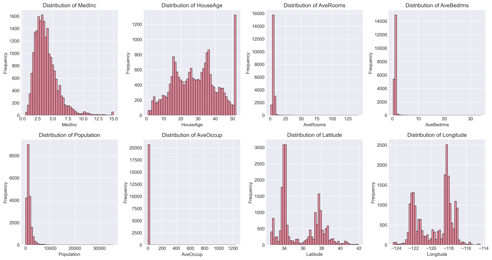
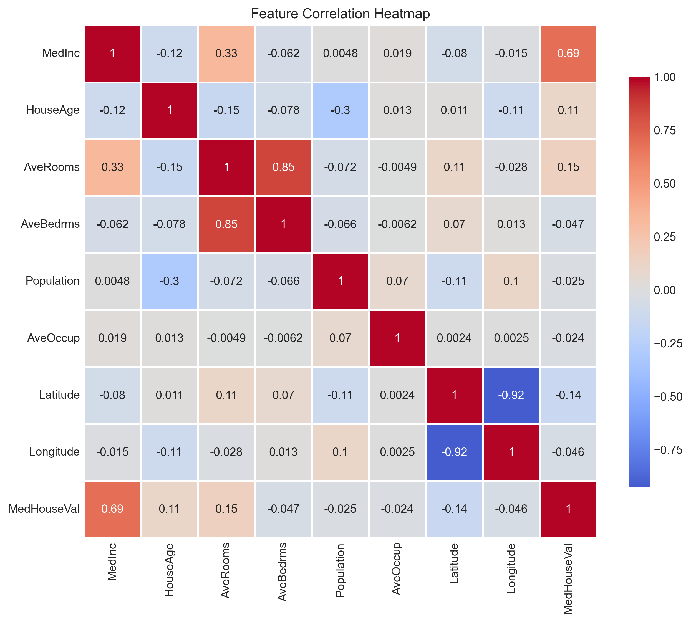
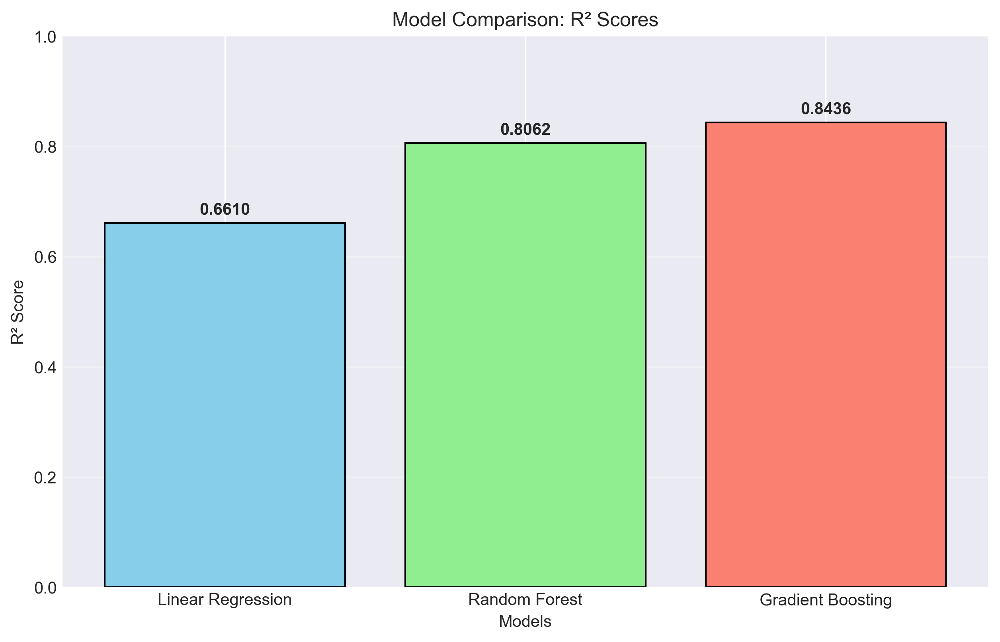
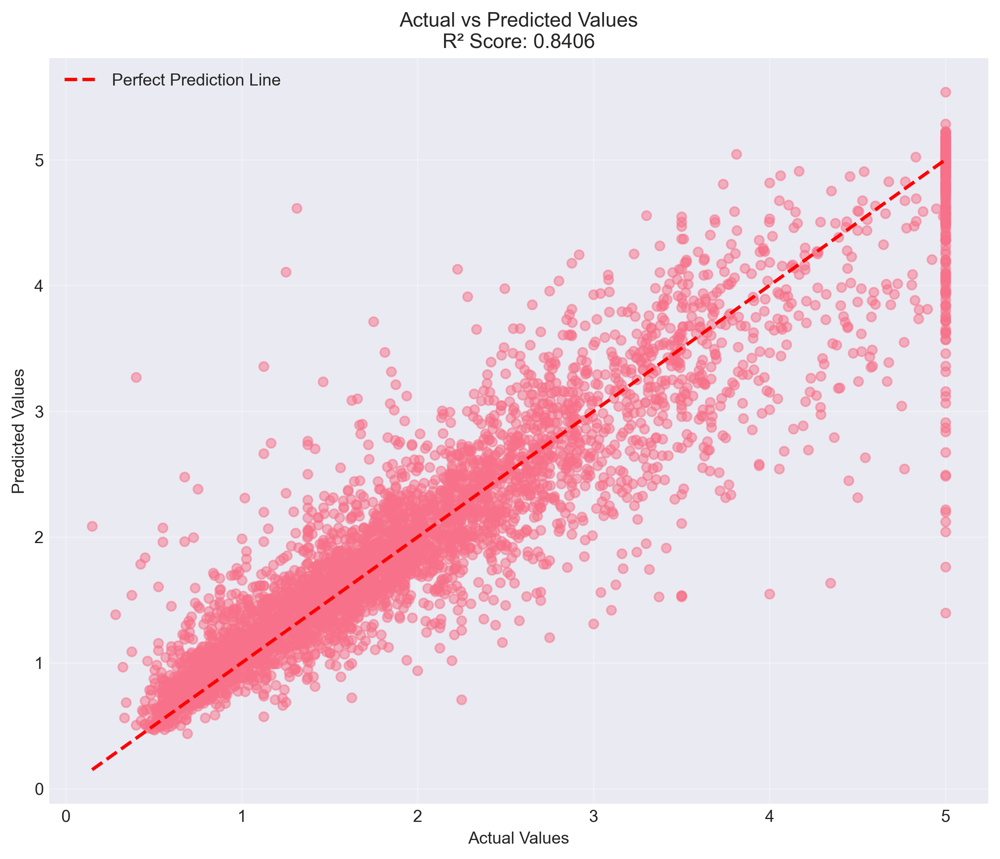
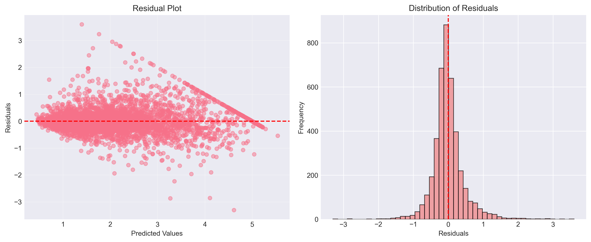

# California Housing Price Prediction with Scikit-learn

[](https://www.python.org/)
[](https://scikit-learn.org/)
[](https://opensource.org/licenses/MIT)

A comprehensive machine learning project demonstrating an end-to-end regression pipeline to predict California housing prices using Scikit-learn. This project focuses on practical implementation of ML workflows, feature engineering, model evaluation, and visualization.

## 📊 Project Overview

This project implements a complete machine learning workflow using the classic California Housing dataset. The goal is to predict median house values using various regression algorithms, with a focus on understanding feature relationships and model performance through comprehensive visualizations.

**Key Highlights:**
- Complete ML pipeline from data loading to model persistence
- Comparative analysis of multiple regression algorithms
- Feature engineering with polynomial feature expansion
- Extensive data visualization for insights and model interpretation
- Model persistence using Joblib for reproducibility

## 📈 Results Summary

- **Best Performing Model:** `HistGradientBoostingRegressor`
- **R² Score:** `0.8436` 
- **Key Insight:** Gradient Boosting outperformed other models, and polynomial features improved linear regression performance significantly

## 🎯 Key Features

### 🔍 Data Exploration & Visualization
- **Feature Distribution Analysis:** Histograms for all 8 features
- **Correlation Analysis:** Heatmap showing feature relationships
- **Target Variable Analysis:** Distribution of median house values

### ⚙️ Feature Engineering
- Polynomial feature expansion to capture non-linear relationships
- Feature scaling for algorithm compatibility
- Feature importance analysis from trained models

### 🤖 Machine Learning Models
- **Linear Regression** (Baseline)
- **Random Forest Regressor** (Ensemble method)
- **HistGradientBoostingRegressor** (Best performer)
- Cross-validation for robust evaluation

### 📊 Model Evaluation
- R² score comparison across algorithms
- Residual analysis and error distribution
- Actual vs. predicted value visualization
- Learning curve analysis

## 📸 Visualizations

### 1. Feature Distributions

*Histograms showing the distribution of all 8 features in the California Housing dataset*

### 2. Correlation Heatmap

*Visualization of feature correlations - highlights relationships between variables*

### 3. Model Performance Comparison

*Bar chart comparing R² scores of Linear Regression, Random Forest, and Gradient Boosting*

### 4. Actual vs. Predicted Values

*Scatter plot showing model predictions against actual values with perfect prediction line*

### 5. Residual Analysis

*Residual plots showing error distribution and patterns in predictions*

## 🗂️ Project Structure

### Core Files
- **`ML-scikit_learn.ipynb`** [] - Complete ML pipeline implementation
- **`README.md`** [] - Project guide and results
- **`requirements.txt`** [] - Package requirements

### Generated Assets
- **`figures/`** [] - Analysis plots
  - `feature_dist_hist.png` - Feature distributions
  - `feature_corr_heatmap.png` - Correlation matrix
  - `model_comparison_r2_scores.png` - Model performance
  - `act_vs_pred_scatter.png` - Prediction accuracy
  - `residual_plot.png` - Error analysis

### Model Artifacts
- **`my_model.joblib`** [] - Trained Gradient Boosting model

## 🚀 Getting Started

### Prerequisites
- Python 3.8+
- pip package manager

### Installation

1. **Clone the repository**
   ```bash
   git clone https://github.com/MarkRoi/scikit-learn-housing.git
   cd ml-scikit-learn-housing

### Install Dependencies
- pip install -r requirements.txt

### Run the jupyter notebook
- jupyter notebook ML-scikit_learn.ipynb

### Dependencies
- scikit-learn>=1.3.0
- numpy>=1.24.0
- pandas>=2.0.0
- matplotlib>=3.7.0
- seaborn>=0.12.0
- joblib>=1.3.0
- jupyter>=1.0.0

## 📖 Detailed Workflow

### 1. Data Loading & Exploration
from sklearn.datasets import fetch_california_housing
housing = fetch_california_housing()

### 2. Feature Engineering
from sklearn.preprocessing import PolynomialFeatures
poly = PolynomialFeatures()
X_poly = poly.fit_transform(X)

### 3. Model Training & Evaluation
from sklearn.ensemble import HistGradientBoostingRegressor
model = HistGradientBoostingRegressor(max_iter=350, learning_rate=0.05)
model.fit(X_train, y_train)

### 4. Model Persistence
import joblib
joblib.dump(model, "my_model.joblib")

## 📊 Model Comparison Results

| Model | R² Score | Key Characteristics |
|:------|:--------:|:--------------------|
| **Gradient Boosting** | **0.8436** | Best overall performance, handles non-linear relationships well |
| Random Forest | 0.806 | Good performance, less prone to overfitting |
| Linear Regression | 0.661 | Baseline model, improved with polynomial features |

### 📈 Performance Insights
- **Gradient Boosting** showed the best performance with an R² score of 0.8436
- **Random Forest** performed competitively at 0.806 with better training efficiency
- **Linear Regression** served as a baseline and improved (from 0.608 to 0.661) with polynomial features

## 🧪 Key Findings & Insights

1. Feature Importance: Median income (MedInc) was the most significant predictor of housing prices
2. Polynomial Impact: Polynomial features improved Linear Regression R² score from 0.608 to 0.661
3. Geospatial Patterns: Latitude and longitude showed moderate correlation with prices
4. Error Analysis: Residuals were normally distributed, indicating good model fit

## 🎓 What I Learned

This project provided hands-on experience with:
- End-to-end ML pipeline development using Scikit-learn
- Feature engineering techniques and their impact on different algorithms
- Model evaluation using multiple metrics and visualization techniques
- Hyperparameter tuning for Gradient Boosting models
- Data visualization for exploratory analysis and results communication
- Model persistence for deployment and reproducibility

## 🔧 Customization

To experiment with the project:
- Adjust polynomial degree in PolynomialFeatures()
- Modify Gradient Boosting hyperparameters (max_iter, learning_rate)
- Try different train-test split ratios
- Experiment with additional algorithms from Scikit-learn

## 🤝 Contributing

Contributions, issues, and feature requests are welcome! Feel free to check .
1. Fork the project
2. Create your feature branch (git checkout -b feature/AmazingFeature)
3. Commit your changes (git commit -m 'Add some AmazingFeature')
4. Push to the branch (git push origin feature/AmazingFeature)
5. Open a Pull Request

## 📧 Contact

Mark Kalema - kalemamark46@gmail.com
Project Link: https://github.com/MarkRoi/scikit-learn-housing.git

## 🙏 Acknowledgments

- Scikit-learn team for the excellent library
- California Housing dataset creators
- Open source community for invaluable resources


